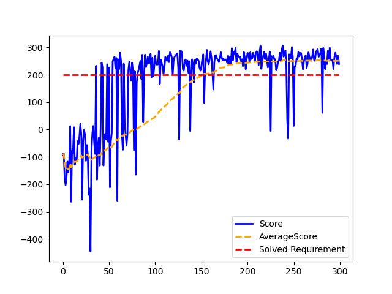
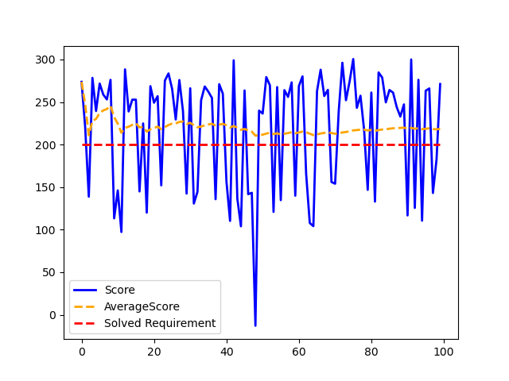
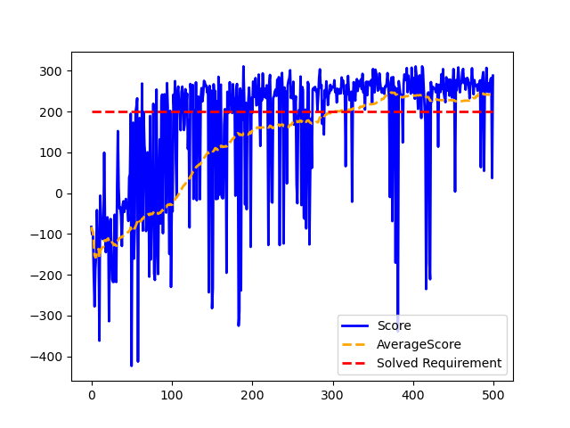
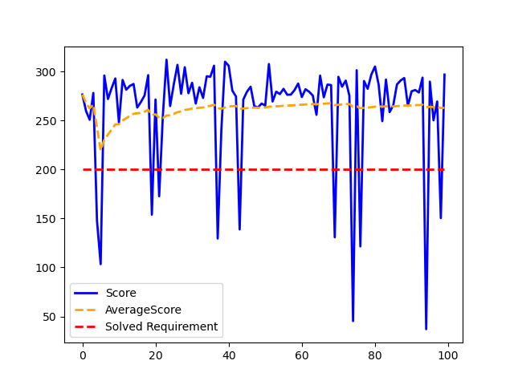
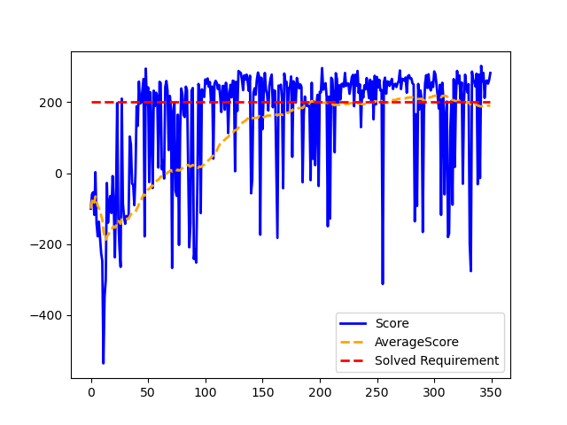
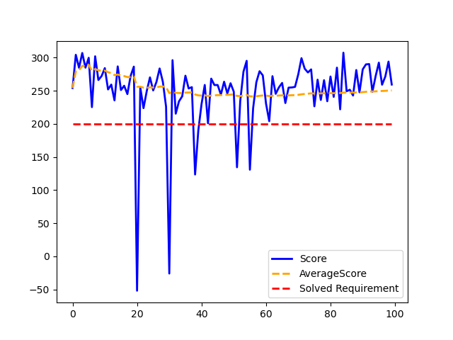

# DSCI6003 Final Project Repository
# Lunar Lander: Reinforcement Learning for Autonomous Navigation and Landing
## Bright Ofori and Jafar Vohra
## Department of Electrical & Computer Engineering and Computer Science
## University of New Haven

### Software / Requirements
Module | Software / Hardware
------------- | -------------
Python IDE | Pycharm
Deep Learning library | Tensorflow + Keras
GPU | GeForce GeForce GTX 1060
Interpreter | Python 3.8
Packages | requirements.txt

**To setup Pycharm + Anaconda + GPU, consult the setup file [here](setup.txt)**.  
**To import the required packages ([requirements.txt](DQN/requirements.txt)), download the file into the project folder and type the following instruction in the project environment terminal:**  
> pip install -r requirements.txt

### **WARNING** 
The training process generates a [.txt file](DQN/saved_networks.txt) that tracks the network models (in 'tf' and .h5 formats) which achieve the solved requirement of the environment. Additionally, an overview image (graph) of the training procedure is created. To perform several training procedures, the .txt, .png, and directory names must be changed. Otherwise, the information of previous training models will get overwritten and therefore lost.  

Regarding testing the saved network models, if using the .h5 model, a 5-episode training is required to initialize/build the keras.model network. Thus, the previously mentioned warnings are also applicable to this situation. Loading the saved model in 'tf' is the recommended option. After finishing the testing, an overview image (graph) of the training procedure is also generated.  

### OpenAI LunarLander-v2
**Actions:** 
0 - No action  
1 - Fire left engine  
2 - Fire main engine  
3 - Fire right engine  

**States:** 
0 - Lander x-coordinate  
1 - Lander y-coordinate  
2 - Lander x-speed  
3 - Lander y-speed  
4 - Lander angle  
5 - Lander angular speed  
6 - Bool: 1 if the first leg has contact, else 0  
7 - Bool: 1 if the second leg has contact, else 0  

**Rewards:** 
- Between 100 and 140 reward for moving from the top of the screen to the landing pad 
- Negative reward if the lander moves away from the landing pad   
- Reward of -100 if the lander crashes  
- Reward of 100 if the lander comes to rest  
- Reward of 10 for each leg of the lander with ground contact  
- Reward of -0.3 per frame for firing the main engine  
- Reward of -0.3 per frame for firing either of the side engines

**Episode termination:** 
- Lander crashes  
- Lander comes to rest  
- Episode length > 400  

**Solved Requirement:** 
- An average reward of 200.0 over 100 consecutive trials  

## Deep Q-Network (DQN)
       
<table>
<tr><th> Train </th><th> Test </th></tr>
<tr><td>

| Parameter | Value |
|--|--|
| Number of episodes | 300 |
| Learning rate  | 0.00075 |
| Discount Factor | 0.99 |
| Epsilon | 1.0 |
| Batch size | 64 |
| TargetNet update rate (steps) | 120 |
| Actions | 4 |
| States | 8 |

</td><td>

| Parameter | Value |
|--|--|
| Number of episodes | 100 |
| Epsilon | 0.01 |
| Actions | 4 |
| States | 8 |

</td></tr> </table>

  
  

  
  

> **Network model used for testing:** 'saved_networks/dqn_model104' ('tf' model, also available in .h5)  

## Dueling DQN

<table>
<tr><th> Train </th><th> Test </th></tr>
<tr><td>

| Parameter | Value |
|--|--|
| Number of episodes | 500 |
| Learning rate  | 0.00075 |
| Discount Factor | 0.99 |
| Epsilon | 1.0 |
| Batch size | 64 |
| TargetNet update rate (steps) | 120 |
| Actions | 4 |
| States | 8 |

</td><td>

| Parameter | Value |
|--|--|
| Number of episodes | 100 |
| Epsilon | 0.01 |
| Actions | 4 |
| States | 8 |

</td></tr> </table>

  
  

  
  

> **Network model used for testing:** 'saved_networks/duelingdqn_model123' ('tf' model, also available in .h5)  

## Dueling Double DQN (D3QN)

<table>
<tr><th> Train </th><th> Test </th></tr>
<tr><td>

| Parameter | Value |
|--|--|
| Number of episodes | 350 |
| Learning rate  | 0.00075 |
| Discount Factor | 0.99 |
| Epsilon | 1.0 |
| Batch size | 64 |
| TargetNet update rate (steps) | 120 |
| Actions | 4 |
| States | 8 |

</td><td>

| Parameter | Value |
|--|--|
| Number of episodes | 100 |
| Epsilon | 0.01 |
| Actions | 4 |
| States | 8 |

</td></tr> </table>

  
  

  
  

> **Network model used for testing:** 'saved_networks/d3qn_model5' ('tf' model, also available in .h5)  
